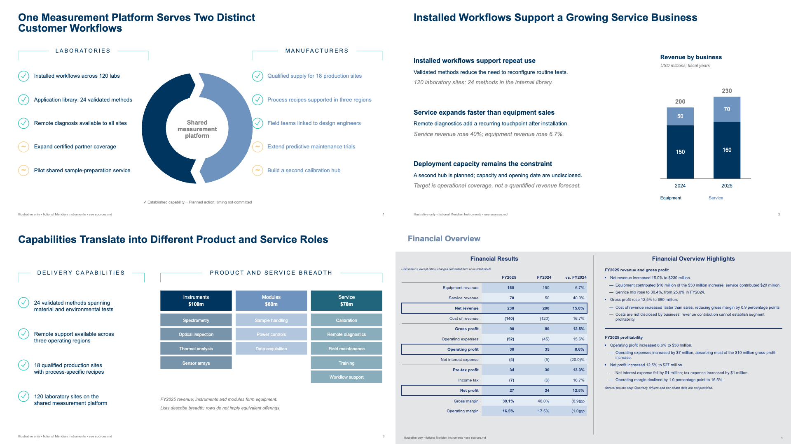

# IB Analysis Slides

English | [简体中文](docs/README.zh-CN.md)

**Turn research into investment-bank-style slides—with editable charts, dense analysis and traceable evidence.**

One agent skill for investment-bank-style presentations. Goldman Sachs style is available now, with more global and Chinese institutions to follow.




All preview data is fictional. Independent project; not affiliated with or endorsed by Goldman Sachs.

## Bank styles

Checked styles are available. Unchecked styles are planned, with no release dates yet.

- [x] Goldman Sachs · 高盛
- [ ] J.P. Morgan · 摩根大通
- [ ] Morgan Stanley · 摩根士丹利
- [ ] Bank of America · 美国银行
- [ ] Citi · 花旗
- [ ] UBS · 瑞银
- [ ] Barclays · 巴克莱
- [ ] CICC · 中金公司
- [ ] CITIC Securities · 中信证券
- [ ] Huatai Securities · 华泰证券

## Install

Download the [latest release](https://github.com/hssqz/ib-analysis-slides/releases/latest) and copy the entire `ib-analysis-slides` folder into your agent's skills directory.

For optional screenshot tooling, see the [setup guide](skills/ib-analysis-slides/references/execution.md).

## Use

Attach your research and ask:

```text
Use $ib-analysis-slides to turn this report into 5 English slides
in Goldman Sachs style. Deliver editable HTML.
```

PPTX export requires a separate exporter.

## Scope and contributing

Current support covers Goldman Sachs-style investor presentations. Detailed capabilities and limits are documented in the release notes.

[Release and validation](docs/release.md) distinguishes tested behavior from remaining limits. An [independent public-package trial](docs/forward-test.md) completed installation and four new English pages using only the public skill. [Contributing](docs/contributing.md) explains how to add a bank profile without duplicating the main skill. If the results help, a star makes the project easier to discover.

## License

[MIT](LICENSE) for the repository's original code, instructions and fictional examples. Institutional names identify the style being studied; no trademark rights are granted. Original institutional reports, report screenshots, logos and commercial fonts are not included. Supply your own permitted research inputs.
