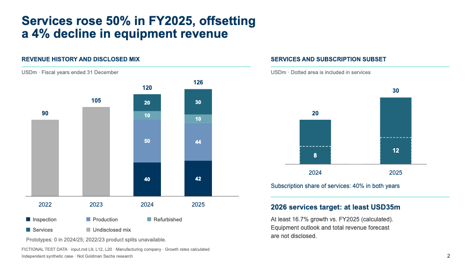
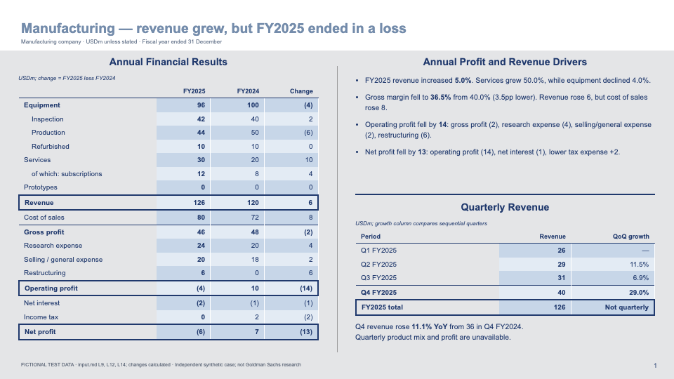
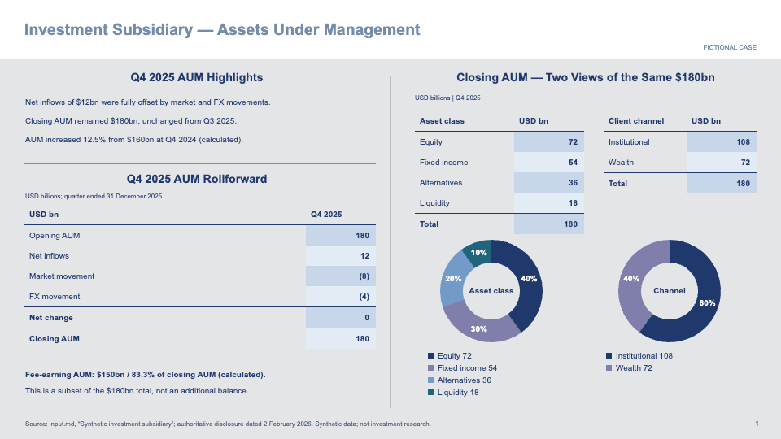

# IB Analysis Slides

**Turn research into investment-bank-style slides—with editable charts, dense analysis and traceable evidence.**

One agent skill. Bank-specific profiles. Currently supports two **Goldman Sachs-inspired** styles: white analytical presentations and gray financial reporting.




All preview data is fictional. Independent project; not affiliated with or endorsed by Goldman Sachs.

## What you get

- Evidence-led page planning: choose an expression for the analytical relationship, then allocate space and typography.
- Editable offline HTML: native text/table cells and SVG charts, with no runtime JavaScript or network resources.
- Two coherent profiles: capabilities, markets and operating mechanisms; or financial results, asset movements and selected balance-sheet metrics.
- Worked examples of selective stacks, subsets, matched-return comparisons, negative values, quantitative donuts, qualitative rings and explicit axis breaks.
- Numerical guardrails: units, periods, denominators, accounting scope and revenue-versus-profit attribution.

This is a skill for a file-capable AI agent, not a deterministic report-to-slide converter or a hosted service. Output quality depends on source evidence and actual review. HTML is the primary deliverable; editable PPTX requires a separate exporter and its own validation.

## Install

Clone the repository, then copy the **whole skill folder** into your agent's skills directory. Do not copy only SKILL.md.

```sh
git clone https://github.com/hssqz/ib-analysis-slides.git
cd ib-analysis-slides

# Codex default location; use your configured skills directory if different.
mkdir -p "${CODEX_HOME:-$HOME/.codex}/skills"
# Fails rather than overwriting an existing installation.
test ! -e "${CODEX_HOME:-$HOME/.codex}/skills/ib-analysis-slides" &&   cp -R skills/ib-analysis-slides "${CODEX_HOME:-$HOME/.codex}/skills/ib-analysis-slides"
```

An agent that can read local instructions can also use `skills/ib-analysis-slides/SKILL.md` directly. Other agent installations should use their documented skills path; their discovery behavior is not tested here.

The HTML workflow has **no companion-skill requirement**. Use the agent's existing document readers and browser. For the optional bundled screenshot tool, install Node.js 20+ dependencies and Chromium in this repository:

```sh
npm ci
npx playwright install chromium
npm test
npm run test:capture
```

Python 3 standard library is used for package checks. Screenshots use Node.js + Playwright + Chromium; system fonts are not embedded. If using an already-installed Chrome, set `BROWSER_EXECUTABLE_PATH`. A separately copied skill can find this clone's Playwright through `NODE_PATH=/absolute/path/to/ib-analysis-slides/node_modules`.

## Use

```text
Use $ib-analysis-slides to turn the attached industry report into a
5-page English analysis. Use the Goldman white analytical profile.
Deliver offline HTML, source/calculation notes and reviewed screenshots.
```

```text
Use $ib-analysis-slides with goldman-earnings-fy2024.
Explain quarterly revenue, expense and profit changes from this release.
Keep accounting scope and one-off items explicit. Deliver HTML only.
```

```text
Update the accepted deck with this new product revenue.
Recompute affected totals, shares and profit explanations, preserve
unaffected pages, and save the revision separately.
```

Choose `goldman-bernstein-2024` for industry/company analysis; `goldman-earnings-fy2024` for financial reporting. The profile date identifies the visual source, not the year of your data. English output is the default; explicit user instructions take precedence.

## Explore the examples

Download/clone and open these HTML files locally:

| Example | Pages | Focus |
|---|---:|---|
| [Analytical deck](skills/ib-analysis-slides/banks/goldman/examples/analysis/index.html) | 4 | Products, history/subsets, peers and returns |
| [Financial deck](skills/ib-analysis-slides/banks/goldman/examples/financial/index.html) | 3 | Profit chain, selected balance sheet and AUM |
| [Relationships and axis break](skills/ib-analysis-slides/banks/goldman/examples/relationships/analysis.html) | 2 | Qualitative client ring and cumulative peers |
| [Dual composition and bridge](skills/ib-analysis-slides/banks/goldman/examples/relationships/financial.html) | 1 | Two views of the same asset stock |



Examples are readable source, not universally auto-fitting templates. See [input and page mapping](skills/ib-analysis-slides/banks/goldman/examples/README.md).

## Scope and contributing

Current support is Goldman Sachs-inspired investor communication, **not an official template or an internal transaction pitchbook library**. Black backgrounds, DCF, complete three-statement models and other banks are not bundled. Complex-chart rendering has targeted tests; autonomous selection of every complex layout is not established.

[Release and validation](docs/release.md) distinguishes tested behavior from remaining limits. [Contributing](docs/contributing.md) explains how to add a bank profile without duplicating the main skill. If the results help, a star makes the project easier to discover.

## License

[MIT](LICENSE) for the repository's original code, instructions and fictional examples. Institutional names identify the style being studied; no trademark rights are granted. Original institutional reports, report screenshots, logos and commercial fonts are not included. Supply your own permitted research inputs.
