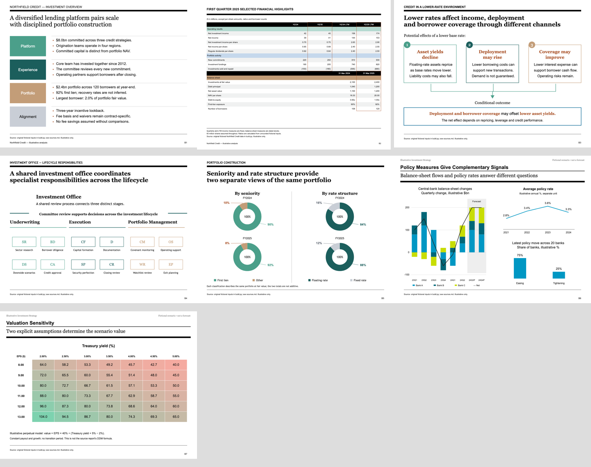
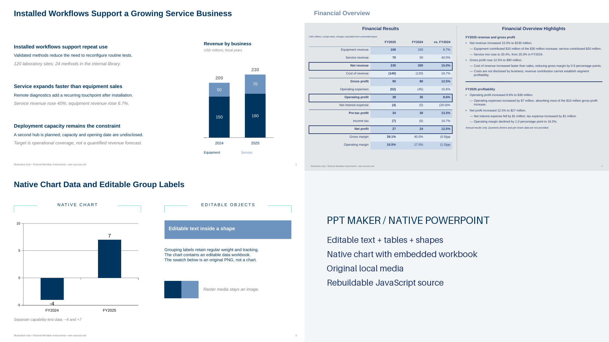

# IB Analysis Slides

English | [简体中文](docs/README.zh-CN.md)

**Turn research into investment-bank-style slides—with editable charts, dense analysis and traceable evidence.**

Two complementary agent skills: `ib-analysis-slides` designs research-backed HTML; `ppt-maker` delivers editable PowerPoint and rebuildable source. Goldman Sachs and five Blackstone-inspired themes are available, with more global and Chinese institutions to follow.


All preview data is fictional. Independent project; not affiliated with or endorsed by Goldman Sachs or Blackstone.



## Bank styles

Checked styles are available. Unchecked styles are planned, with no release dates yet.

- [x] Goldman Sachs · 高盛
- [x] Blackstone · 黑石 (five historical themes; selected analytical capabilities)
- [ ] J.P. Morgan · 摩根大通
- [ ] Morgan Stanley · 摩根士丹利
- [ ] Bank of America · 美国银行
- [ ] Citi · 花旗
- [ ] UBS · 瑞银
- [ ] Barclays · 巴克莱
- [ ] CICC · 中金公司
- [ ] CITIC Securities · 中信证券
- [ ] Huatai Securities · 华泰证券

## Install

Download the [latest release](https://github.com/hssqz/ib-analysis-slides/releases/latest):

- **HTML:** install the complete `ib-analysis-slides` folder.
- **HTML + PPTX:** also install the complete `ppt-maker` folder, then run `npm ci --ignore-scripts` inside it (Node20+, Python3.10+).

The skills install independently. [PowerPoint setup and handoff](docs/pptx/workflow.md) covers source delivery, rendering and the legacy-version boundary.

For optional screenshot tooling, see the [setup guide](skills/ib-analysis-slides/references/execution.md).

## Use

Attach your research and ask:

```text
Use $ib-analysis-slides to turn this report into 5 English slides
in Goldman Sachs style. Deliver editable HTML.
```

For Blackstone, specify the analytical purpose; the skill routes to the corresponding historical theme:

```text
Use $ib-analysis-slides to make an English Blackstone-style company overview
and earnings analysis from these reports. Deliver offline HTML with sources.
```

After approving the HTML, ask:

```text
Use $ppt-maker to reproduce these approved HTML pages as editable PPTX.
Preserve the content, layout and Goldman typography; include rebuildable source.
```

The companion uses PptxGenJS and exports native text, tables, shapes and charts where appropriate. Images remain images; chart editability is recorded per output. It does not promise automatic lossless HTML conversion.



[Download the editable PPTX example](https://github.com/hssqz/ib-analysis-slides/releases/download/v0.8.0/ppt-maker-example.pptx).

## Scope and contributing

Current support covers Goldman Sachs-style investor presentations and five Blackstone-inspired historical themes: investor, earnings, credit-market, Investor Day and investment strategy. Blackstone has seven original examples; the full observed source-page catalog is not a blanket implementation promise. Detailed capabilities and limits are documented in the release notes.

[Release and validation](docs/release.md) distinguishes tested behavior from remaining limits. An [independent public-package trial](docs/forward-test.md) completed installation and four new English pages using only the public skill. [Contributing](docs/contributing.md) explains how to add a bank profile without duplicating the main skill. If the results help, a star makes the project easier to discover.

## License

[MIT](LICENSE) for the repository's original code, instructions and fictional examples. Institutional names identify the style being studied; no trademark rights are granted. Original institutional reports, report screenshots, logos, commercial fonts and the legacy mirrored editor/WASM are not included. PptxGenJS and its dependencies retain their upstream licenses; see [backend provenance](skills/ppt-maker/references/provenance.md). Supply your own permitted research inputs.
